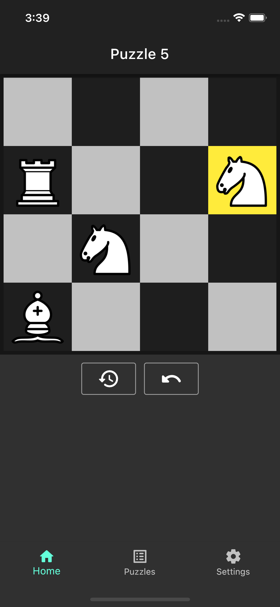
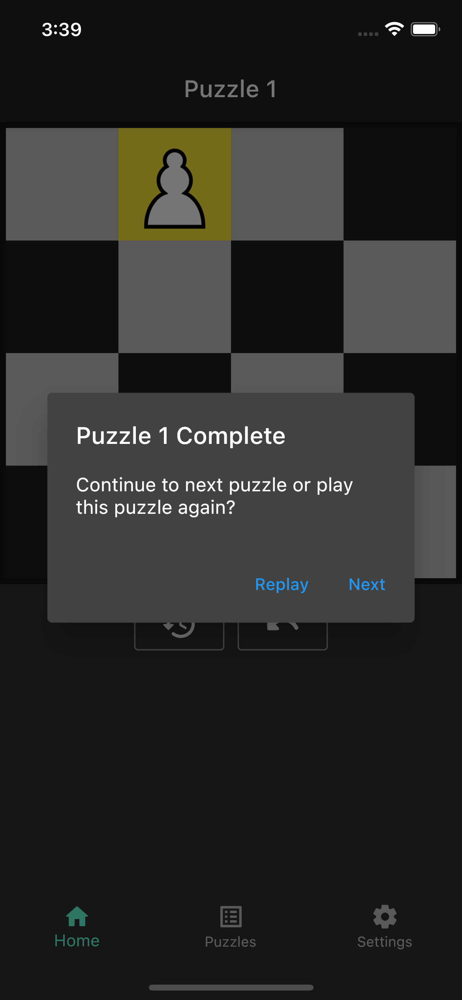
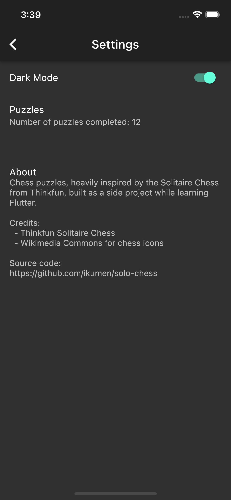
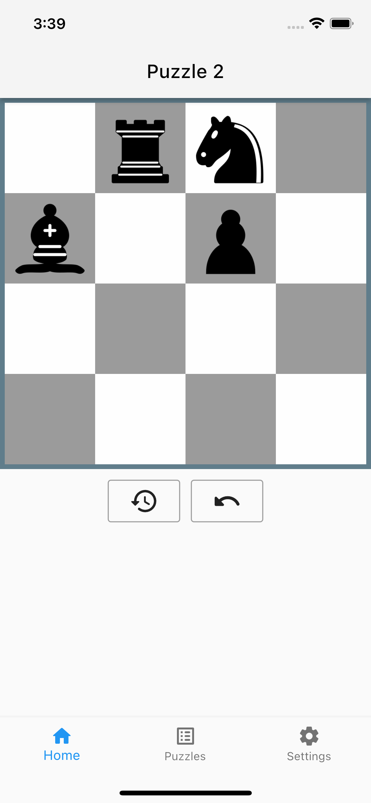

# Solo Chess

A Flutter chess puzzles application inspired by [Thinkfun's Solitaire Chess](https://www.thinkfun.com/products/brain-fitness-solitaire-chess/).
I wrote it as a side project for learning Flutter, plus we have the physical game at home and the kids thought an app version would be great to bring on long car rides.

 
 

### Credits

* Thinkfun Solitaire Chess (game idea)
* Wikimedia Commons (chess icons)
